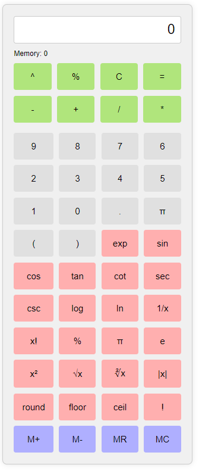

# React Calculator App

A powerful and user-friendly calculator app built with React.js. This calculator supports basic arithmetic operations, memory functions, and a variety of special mathematical functions.

## Features

- **Basic Operations**: Addition, subtraction, multiplication, and division.
- **Memory Functions**: Memory add, subtract, recall, and clear.
- **Special Functions**: Includes exponential, trigonometric (sin, cos, tan, etc.), logarithmic, and other advanced mathematical functions.
- **Error Handling**: Displays "Error" for invalid operations.

## Try It Yourself

To try this calculator on your own device, follow these steps:

1. **Create a new React app**:

```bash
npx create-react-app my-calculator-app
cd my-calculator-app
```
2. **Replace the content of App.js and App.css:**
  - Copy the code of App.js and App.css from this repository.
  - Paste it into your own App.js and App.css files in your newly created React app.

3. Install the required dependency:
```
```bash
npm install mathjs
```

4. Start the application:
```bash
npm start
```
The app should now be running on http://localhost:3000.

## Usage

1. **Basic Usage**:
   - Click the number buttons to input values.
   - Use the operators (`+`, `-`, `*`, `/`) for arithmetic operations.
   - Click `=` to evaluate the expression.
   - Click `C` to clear the display.

2. **Memory Functions**:
   - `M+`: Add the current display value to memory.
   - `M-`: Subtract the current display value from memory.
   - `MR`: Recall the memory value and append it to the display.
   - `MC`: Clear the memory.

3. **Special Functions**:
   - Functions like `exp`, `sin`, `cos`, `tan`, and others are available as buttons. Click the respective button after entering a value to apply the function.
   - Constants like `π` and `e` can be directly used by clicking their respective buttons.

## Project Structure

- `src/`
  - `App.js`: Main React component for the calculator.
  - `App.css`: CSS file for styling the calculator.
  - `index.js`: Entry point of the application.

 <div align="center">
   


## Contributing

Contributions are welcome! Please fork the repository and create a pull request with your changes.

1. Fork the project
2. Create your feature branch (`git checkout -b feature/AmazingFeature`)
3. Commit your changes (`git commit -m 'Add some AmazingFeature'`)
4. Push to the branch (`git push origin feature/AmazingFeature`)
5. Open a pull request

## Live Demo
View the live demo of this project here: [Calculator](https://calculator-omega-nine-65.vercel.app/)

## Acknowledgements

- [React.js](https://reactjs.org/)
- [Math.js](https://mathjs.org/)
